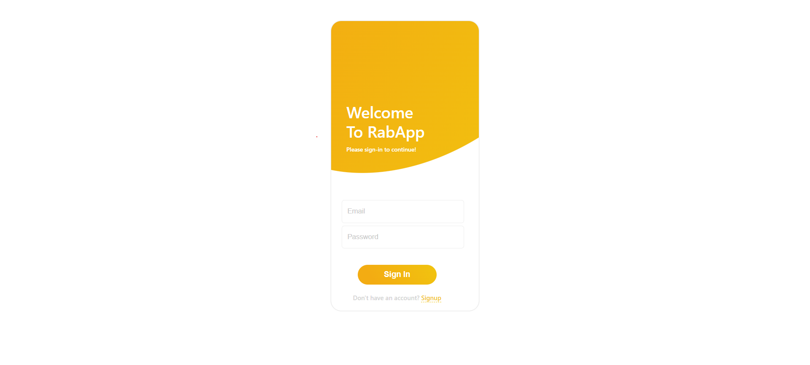
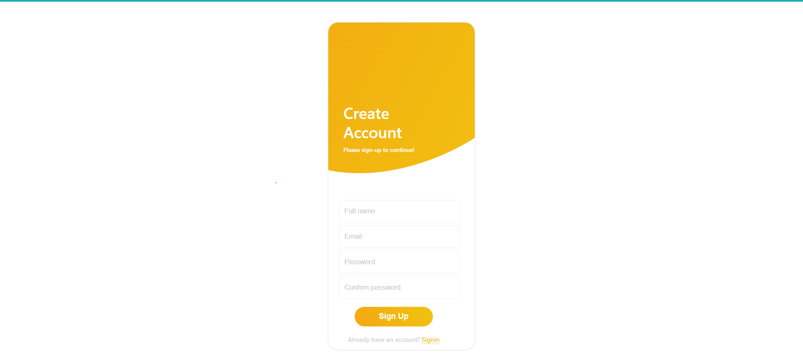
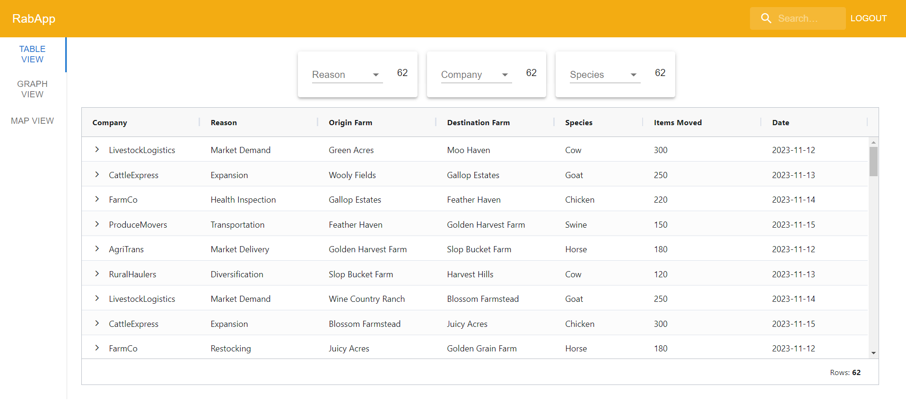
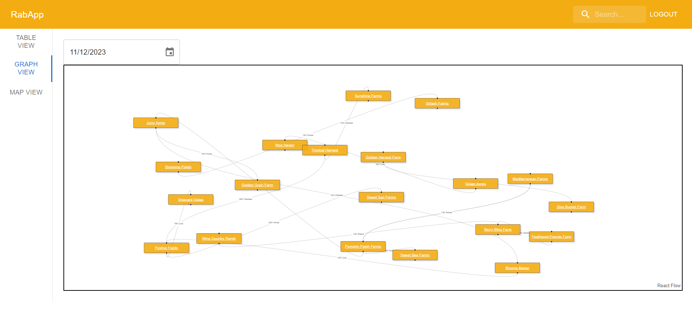
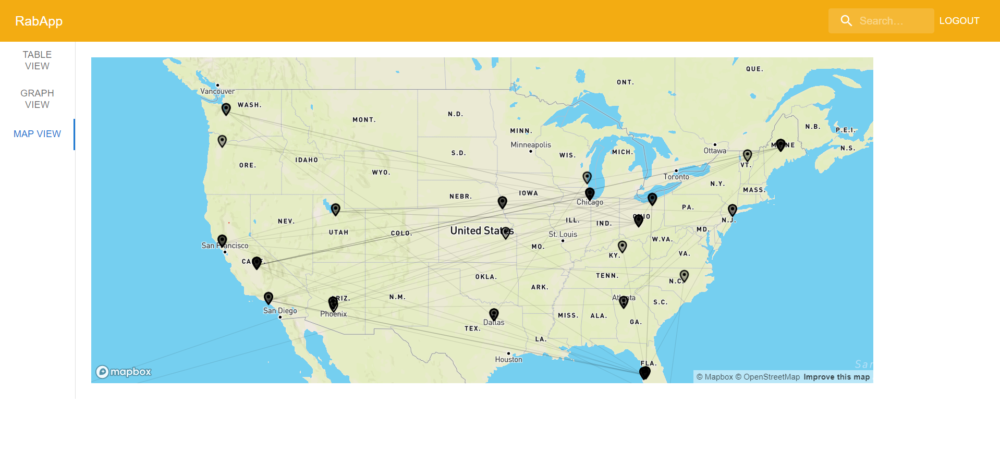
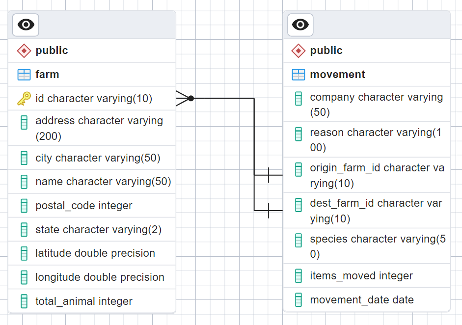

# RabApp - Livestock Mobility Analyzer

This application aims to visually represent and analyze the movement of livestock between different farms.

## How to Run

1. Clone this repository.
2. Execute `docker-compose up` in the root folder containing the `docker-compose.yml` file.
3. Open `http://localhost:3000/login` in your web browser.
4. View `RabApp Demo.mp4` to get familiarized with all the functionality that the app offers.

## UI Screenshots

Login Page:

Table View:

Graph view:

Map view:

## Features

1. Users can register on the application and use those credentials for logging into the platform.
2. The table provides a comprehensive history of animal movements between farms.
3. Each row can be expanded to view detailed information about the origin and destination farms.
4. Convenient card filters offer quick filtering options and display the corresponding row counts.
5. Column-specific filters can be utilized by hovering over the column header, clicking on the menu icon, and selecting the filter option.
6. The global search field at the top right corner enables a comprehensive search across all columns.
7. The graph view presents a graphical representation of animal movements between farms. Hover over the farm names to view other details. Adjust the movement dates using the date picker.
8. The map view shows all the farms located accross the USA and the movement of animals between these farms. Hover over these farms to view other details.

## App Design

1. The app revolves around two entities: farm and movement. The ERD diagram is as follows,
   
2. Tables are created and seeded by the Spring Boot application during startup after the database is initiated by Docker.
3. Database changes are managed using Liquibase. Refer to `farm-rest/src/main/resources/db/changelog/db.changelog-master.yaml` for the changelog.
4. The Spring Boot app utilizes JPA queries to fetch data from the database, ensuring agnosticism of the underlying database engine.
5. The frontend is constructed using React-Redux. Despite the current simplicity of data and required functionality, Redux state is implemented for scalability. This ensures scalability as a transition to Redux in the future is very taxing after a lot of functionality has been implemented and also increases the likelihood of bugs.

## Future Improvements

1. At present, user credentials are encrypted and stored in memory. An optimal strategy would involve implementing token-based authentication to enhance security.
2. Tokens ought to be employed in every API call to validate the user's integrity.
3. Enhancing code robustness can be achieved by incorporating unit test cases.
4. Improve the user experience by adding filters and appropriate notations in the Graph and Map views that are easier to understand.
